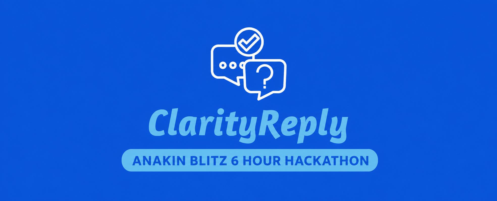

<div align="center">
  
# ClarityReply

</div>

Built by **Tejasvi Bajaj** for **Anakin Blitz**, a **6-hour hackathon**.

ClarityReply is a Django-based AI reply workspace that extracts social post context from URLs or screenshots and generates platform-aware reply variations. It is designed for people who need to respond quickly across social platforms without sounding generic, robotic, or out of place.

## Badges


[](https://youtu.be/rgVUMTHk-vA)
[](https://x.com/i/status/2061200836987159025)

## Problem Statement

Writing good replies across platforms is harder than it looks.

A reply that works on LinkedIn sounds too formal for Instagram. A reply that works in WhatsApp or Discord needs conversation history. A YouTube comment should feel supportive and discussion-friendly. Most AI-generated replies ignore these platform norms and produce generic responses like “Great insights, thanks for sharing.”

The core problem:

> How can a user quickly extract context from a social post and generate human, platform-native reply variations without manually copying, cleaning, and re-prompting content?

## Solution

ClarityReply provides a simple workflow:

1. Paste a social post URL or upload a screenshot.
2. Extract structured context such as platform, title, content, summary, author, and engagement signals.
3. Review or adjust extracted data when relevant.
4. Generate three alternate phrasings of the same reply strategy.
5. Copy a reply and optionally open the original post URL.

The product focuses on **reply generation only**. It avoids long analysis, meta commentary, and personality-split outputs. Instead of “Professional / Friendly / Engaging” replies, it returns:

```json
{
  "variation_1": "",
  "variation_2": "",
  "variation_3": ""
}
```

## Features

- URL extraction through Anakin URL Scraper.
- Screenshot OCR through Gemini vision.
- Platform detection for LinkedIn, Twitter/X, Instagram, YouTube, Reddit, Facebook, TikTok, Discord, WhatsApp, and Custom.
- Dedicated parsing improvements for YouTube and Instagram.
- Platform-native prompt rules, especially for Instagram.
- Discord and WhatsApp conversation context support.
- Generated reply cards with copy buttons and word counts.
- Django admin dashboard for inspecting extraction and generation data.
- No database schema changes required beyond the existing `ReplyRequest` model.

## Architecture

```text
User
  |
  v
Frontend UI
  |
  |-- URL extraction request
  |-- Screenshot extraction request
  |-- Reply generation request
  v
Django Views
  |
  |-- ExtractContentView
  |-- GenerateReplyView
  v
Services
  |
  |-- ContentExtractionService
  |     |-- Anakin URL Scraper
  |     |-- Gemini OCR
  |
  |-- ClarityReplyService
        |-- Gemini reply generation
  |
  v
ReplyRequest model
  |
  v
JSON response back to frontend
```

See the full hackathon write-up in [docs/anakin-blitz-submission.md](docs/anakin-blitz-submission.md).

## Tech Stack

- **Backend:** Django
- **Frontend:** HTML, CSS, JavaScript
- **Database:** SQLite for local development
- **AI:** Google Gemini via `google-genai`
- **URL Extraction:** Anakin URL Scraper
- **Parsing:** BeautifulSoup, JSON-LD parsing, platform-specific extraction logic
- **Admin:** Django Admin

## Supported Platforms

- LinkedIn
- Twitter/X
- Instagram
- YouTube
- Reddit
- Facebook
- Discord
- WhatsApp
- TikTok
- Custom

## API Flow

### Extract Content

```text
POST /api/extract/
```

Inputs:

- `source_type`: `url` or `screenshot`
- `url`: required for URL extraction
- `image`: required for screenshot extraction
- `platform`: selected platform

Returns:

- `request_id`
- `platform_data`
- `platform`
- `url`
- `title`
- `summary`
- `content`
- `author_name`
- `author_username`
- engagement fields where available

### Generate Reply

```text
POST /api/generate-reply/
```

Inputs:

- `request_id` or `post_content`
- `platform`
- editable extracted fields
- reply preferences
- optional `previous_messages` for Discord and WhatsApp

Returns:

```json
{
  "variation_1": "",
  "variation_2": "",
  "variation_3": ""
}
```

## Installation

```bash
git clone [Add repository URL]
cd ClarityReply
python3 -m venv .venv
source .venv/bin/activate
pip install -r requirements.txt
```

## Environment Variables

Create a `.env` file or configure these variables in your shell:

```bash
SECRET_KEY="[Add Django secret key]"
DEBUG=True
DATABASE_URL="[Add database URL]"
GEMINI_API_KEY="[Add Gemini API key]"
GEMINI_MODEL="gemini-2.5-flash"
ANAKIN_API_KEY="[Add Anakin API key]"
ANAKIN_API_BASE="https://api.anakin.io"
ALLOWED_HOSTS="localhost,127.0.0.1"
```

## Local Development

```bash
python3 manage.py migrate
python3 manage.py runserver
```

Open:

```text
http://127.0.0.1:8000/
```

Admin:

```text
http://127.0.0.1:8000/admin/
```

Run checks:

```bash
python3 manage.py check
python3 -m compileall core
```

## Screenshots

<table>
  <tr>
    <td align="center"><b>Desktop</b></td>
    <td align="center"><b>Mobile</b></td>
  </tr>
  <tr>
    <td></td>
    <td></td>
  </tr>
  <tr>
    <td></td>
    <td></td>
  </tr>
  <tr>
    <td></td>
    <td></td>
  </tr>
  <tr>
    <td></td>
    <td></td>
  </tr>
  <tr>
    <td></td>
    <td></td>
  </tr>
  <tr>
    <td></td>
    <td></td>
  </tr>
  <tr>
    <td></td>
  </tr>
</table>

## Future Roadmap

- Browser extension for replying directly on social platforms.
- More platform-specific parsers.
- Saved reply history and favorites.
- Team workspace support.
- Better analytics for reply performance.
- Deployment-ready production settings.

## Author

**Tejasvi Bajaj**

Built for **Anakin Blitz**, a **6-hour hackathon**.

